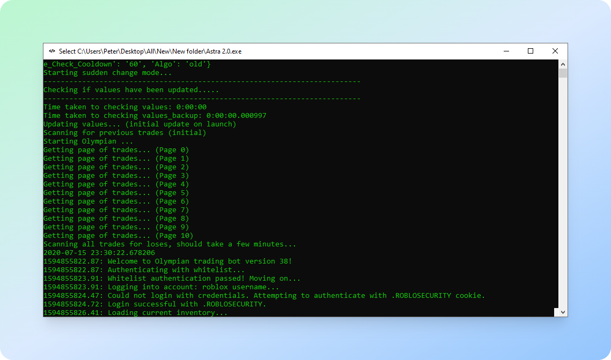
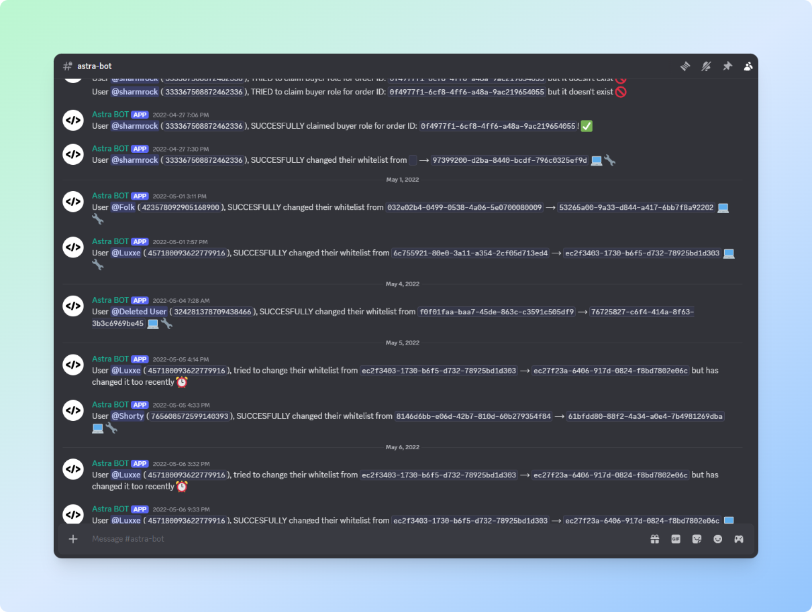

<div align="center">
  <h1>Astra 🌌</h1>
</div>



## Features


## Installation

- Ensure Python is installed (recommend 3.9+).
- From the repo root, install all dependencies for both the Discord bot and the whitelist CLI:

```
python -m pip install -r requirements.txt
```

## 📦 Distribution

For information about the build system and executables, see the 
- [Distribution README](https://github.com/peter-bf/Astra/tree/master/dist#readme)

<div align="center">
  <h2>Discord Bot System 🤖</h2>
</div>



The **Astra Discord Bot** serves as the bridge between **Astra’s backend infrastructure**, **Shoppy.gg’s purchase API**, and the **Discord user network**.  

For all specifications and technical details options, see [Distribution README](https://github.com/peter-bf/Astra/tree/master/discordBot).

It operates as an autonomous verification and access control daemon, continuously synchronizing user data across systems.

---

### ⚙️ Architecture Overview

| Component | Description |
|------------|-------------|
| **Shoppy API Listener** | Polls Shoppy.gg REST API every few minutes for new transactions. |
| **Database Engine** | Maintains a JSON-based order registry with locked atomic updates. |
| **Threading System** | Multi-threaded monitoring with watchdog self-restart and fault tolerance. |
| **Discord Command Interface** | Provides secure DM-based commands for buyers ($buyer, $whitelist, $help). |
| **Whitelist Sync Module** | Rebuilds and deploys machine whitelists to Astra’s secure web endpoint. |
| **Logging Core** | Streams structured logs to Discord for administrative tracking. |

---

### 🧠 Core Features

- **Real-Time Order Syncing:** Automatically detects and registers new Shoppy purchases via authenticated API calls.  
- **Distributed Whitelist Management:** Hash-based whitelist keys tied to user-specific hardware identifiers, regenerated and deployed after each change.  
- **Cooldown Enforcement:** Enforces controlled whitelist regeneration intervals (default: 5 days).  
- **Concurrent Safety:** Thread locks prevent write collisions during database and whitelist updates.  
- **Fault Recovery:** A persistent watchdog thread ensures self-healing in case of monitor thread failure.  
- **Command Protocol:** Secure DM commands (`$buyer`, `$whitelist`, `$help`) for user onboarding and management.  
- **Secure Data Flow:** Verified Shoppy transactions → Astra database → Discord verification → Whitelist sync.

---

### 🧩 Data Flow Summary

```
User Purchase (Shoppy.gg)
       ↓
Bot Fetches New Orders (API Poll)
       ↓
Database Update + Backup (JSON)
       ↓
User Executes $buyer / $whitelist
       ↓
Whitelist Generated + Uploaded (/var/www/html/whitelists)
       ↓
Discord Role Assigned + Log Sent
```

---

### 🔒 Reliability Features

- Multi-threaded design ensures uninterrupted background monitoring.
- Full backup retention in `db_backups/` and `whitelist_backups/`.
- Continuous upload verification with fallback recovery.
- Minimal latency between purchase and role assignment.

---

This subsystem represents the **automation core of Astra’s licensing and access infrastructure**,  
delivering real-time validation, customer management, and secure distribution pipelines across Shoppy, Discord, and Astra servers.


